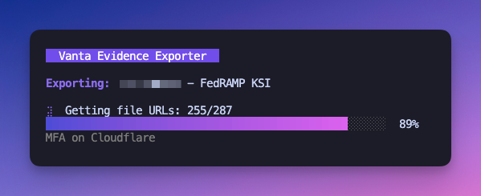

# Vanta-Go-Export

CLI tool to export Vanta audit evidence organized by control.



## Build

```
go build -o vanta-exporter .
```

## Usage

```
# interactive mode - prompts for creds
./vanta-exporter

# with flags
./vanta-exporter --client-id=vci_xxx --client-secret=vcs_xxx --all

# with env vars
export VANTA_CLIENT_ID=vci_xxx
export VANTA_CLIENT_SECRET=vcs_xxx
./vanta-exporter --all
```

## Options

```
--client-id      Vanta OAuth client ID
--client-secret  Vanta OAuth client secret
--audit-id       Export specific audit
--all            Export all audits
--output         Output dir (default: ./export)
--no-tui         Skip interactive UI
```

## Output

```
export/
  CustomerName_Framework_AuditID/
    _audit_info.json    # audit metadata
    _index.csv          # evidence index
    ControlName/
      metadata.json     # evidence details
      file1.pdf
      file2.json
      ...
```
