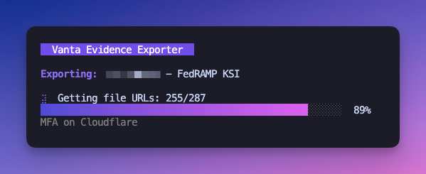

# Vanta-Go-Export

CLI tool to export Vanta audit evidence organized by control.



## Installation

### Homebrew (macOS/Linux)

```bash
brew install ethanolivertroy/sectools/vanta-exporter
```

### Scoop (Windows)

```powershell
scoop bucket add sectools https://github.com/ethanolivertroy/scoop-sectools
scoop install vanta-exporter
```

### Download Binary

Download from [Releases](https://github.com/ethanolivertroy/vanta-go-export/releases):

| Platform | Binary |
|----------|--------|
| macOS (Apple Silicon) | `vanta-exporter-darwin-arm64` |
| macOS (Intel) | `vanta-exporter-darwin-amd64` |
| Linux (x64) | `vanta-exporter-linux-amd64` |
| Linux (ARM64) | `vanta-exporter-linux-arm64` |
| Windows (x64) | `vanta-exporter-windows-amd64.exe` |

### Go Install

```bash
go install github.com/ethanolivertroy/vanta-go-export@latest
```

### Build from Source

```bash
git clone https://github.com/ethanolivertroy/vanta-go-export.git
cd vanta-go-export
go build -o vanta-exporter .
```

## Usage

```
# interactive mode - prompts for creds
./vanta-exporter

# with env vars (recommended)
export VANTA_CLIENT_ID=vci_xxx
export VANTA_CLIENT_SECRET=vcs_xxx
./vanta-exporter --all

# with stdin for the secret
printf '%s' 'vcs_xxx' | ./vanta-exporter --client-id=vci_xxx --client-secret-stdin --all

# with a flag (supported, but riskier)
./vanta-exporter --client-id=vci_xxx --client-secret=vcs_xxx --all
```

`--client-secret` is kept for compatibility, but it is the least safe option. Command-line arguments can be exposed through shell history, process listings like `ps`, and shared-system auditing. Prefer `VANTA_CLIENT_SECRET` or `--client-secret-stdin` when possible.

## Options

```
--client-id      Vanta OAuth client ID
--client-secret  Vanta OAuth client secret (discouraged: may be exposed in shell history or process listings)
--client-secret-stdin  Read the Vanta OAuth client secret from stdin
--audit-id       Export specific audit
--all            Export all audits
--output         Output dir (default: ./export)
--no-tui         Skip interactive UI
```

## Output

```
export/
  CustomerName_Framework_AuditID/
    _audit_info.json    # audit metadata
    _index.csv          # evidence index
    ControlName/
      metadata.json     # evidence details
      file1.pdf
      file2.json
      ...
```
